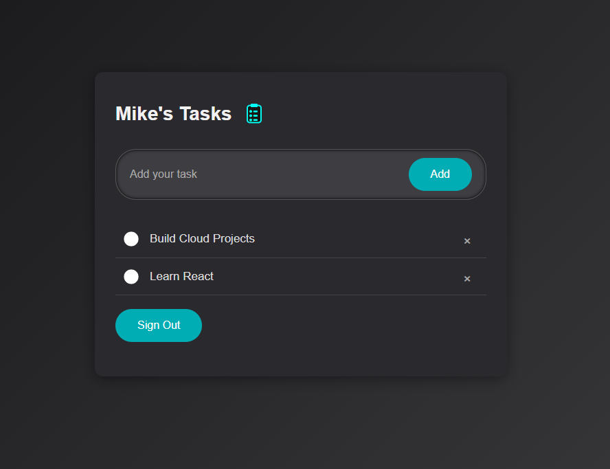

# 📦 Deploying a React Task App with AWS Amplify

This project is a simple **task management (CRUD) application** built with **React** and deployed using **AWS Amplify**. It was developed to deepen practical understanding of key AWS services and how they integrate within a modern full-stack application.

## ✅ AWS Services Used

- **AWS Amplify** – Frontend hosting and CI/CD

- **Amazon Cognito** – User authentication and management

- **AWS API Gateway** – REST API endpoint management

- **AWS Lambda** – Serverless backend functions

- **Amazon DynamoDB** – NoSQL database for task data

The app allows users to securely **create, read, update, and delete tasks**, demonstrating how multiple AWS services can work together to support scalable, cloud-native applications.

