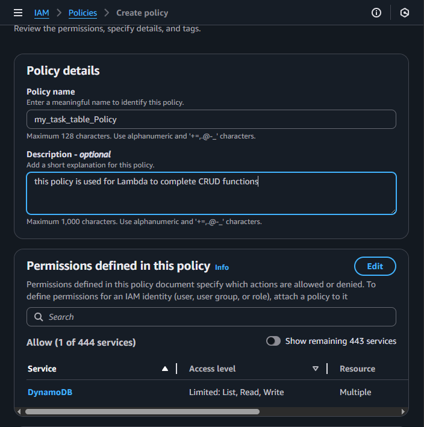

# 📝 Task App Project Backend

A full-stack task management application using AWS services for backend and React for the frontend. This guide documents the complete setup of backend services on AWS using **Lambda**, **API Gateway**, **IAM**, and **DynamoDB**.

## 📑 Table of Contents

- [DynamoDB Table](#️-building-dynamodb-table)

- [IAM](#-create-iam-policy-and-role)

  - [Create IAM Policy](#-iam-policy)

  - [Create IAM Role](#-iam-role)

- [Lambda Function](#-create-lambda-function)

  - [Update Lambda Function](#-update-lambda-function)

  - [Edit Lambda Configuration](#-edit-lambda-configuration)

  - [Test Lambda Function](#-testing-lambda-function)

  - [Validate in DynamoDB](#-validate-dynamodb-table)

- [API Gateway](#-create-api-gateway)

  - [Create Method](#-create-method)

  - [Enable CORS](#-enable-cors)

  - [Test API](#-test-api)

  - [Validate in DynamoDB](#-validate-dynamodb-table-1)

  - [Deploy API](#-deploy-api)

# 🔧 Deploying AWS Backend Services

## 🗃️ Building DynamoDB Table

DynamoDB stores tasks and their completion status.

1. Go to **DynamoDB** in the AWS Console.
2. Select **Create Table**.


3. Input:

   - Table Name: e.g., `my_task_table`

   - Partition Key: `task` (Type: String)


4. Leave other settings as default.
5. Click **Create Table**.

---

## 🔐 Create IAM Policy and Role

IAM allows your Lambda function to access DynamoDB securely.

### 📃 IAM Policy

1. Go to **IAM → Policies → Create policy**.


2. Choose **Service: DynamoDB**.

3. Select the following permissions:

   - `ListTables`, `GetItem`, `Scan`, `DeleteItem`, `PutItem`

4. Under **Resources**, select **Specific**, then click **Add ARNs** for **table**.


5. Provide your Region and Table name.


6. Name your policy and click **Create policy**.



### 👨 IAM Role

1. Go to **IAM → Roles → Create role**


2. Choose **Trusted entity type: AWS Service**

3. Use case: **Lambda**


4. Attach the **policy** created above.


5. Name the role and click **Create role**.


6. Follow the same steps to create a role for **Amplify**
   - Use case: **Amplify**
   - Policy: **AdministratorAccess-Amplify**

---

## 💻 Create Lambda Function

1. Go to **Lambda → Create Function**


2. Choose **Author from scratch**

3. Set:

   - **Function Name**: e.g., TaskHandler

   - **Runtime**: Python (latest)

   - **Execution role**: Use existing → select the IAM role from above


4. Click **Create function**

### 🛠️ Update Lambda Function

1. In `lambda_function.py`, replace the boilerplate with:

```python
from dynamodb_handler import DynamoDB

def lambda_handler(event, context):
    ddb = DynamoDB(event)
    items = ddb.main()
    return {
        'statusCode': 200,
        'items': items
    }
```


2. Create a new file: `dynamodb_handler.py`

```python
import boto3

client = boto3.client('dynamodb')


class DynamoDB:
    def __init__(self, data):
        self.table = self.get_table()
        self.data = data
        self.key = 'task'
        self.sort = 'complete'

    def get_table(self):
        response = client.list_tables()
        for table in response['TableNames']:
            if 'INPUT YOUR TABLE NAME HERE' in table:
                return table

    def scan_items(self):
        response = client.scan(
            TableName = self.table
        )
        return response['Items']

    def format_items(self):
        items = self.scan_items()
        list_items = [{
            k: item[k]['S']
            for k in item.keys()
            }
            for item in items
            ]
        return list_items

    def delete_task(self, task):
        client.delete_item(
            TableName = self.table,
            Key = {
                self.key: {
                    'S': task
                }
            }
        )

    def new_task(self, task, complete):
        client.put_item(
            TableName = self.table,
            Item = {
                self.key: {
                    'S': task
                },
                self.sort: {
                    'S': complete
                }
            }
        )


    def update_task(self, task, complete):
        client.update_item(
            TableName = self.table,
            Key = {
                self.key: {
                    'S': task
                }
            },
            AttributeUpdates = {
                self.sort: {
                    'Value': {
                        'S': complete
                    },
                    'Action': 'PUT'
                }
            }
        )

    def complete_action(self, keys):
        function_map = {
            "add": self.new_task,
            "delete": self.delete_task,
            "update": self.update_task
        }
        task = self.data[self.key]
        complete = self.data[self.sort]
        key = keys[2]
        if self.data[key] == 'delete':
            function = function_map[self.data[key]]
            function(task)
        else:
            function = function_map[self.data[key]]
            function(task, complete)

    def main(self):
        keys = list(self.data)
        if "action" in keys:
            self.complete_action(keys)
        return self.format_items()
```

> 🔔 **Note**: Modify (Line 16), `'my_task'`, in `get_table()` to match part of your DynamoDB table name.


3. Click **Deploy**

### ⚙️ Edit Lambda Configuration

1. Go to the **Configuration** tab

2. Click **Edit** in General Configuration


3. Set Timeout: **5 minutes**

4. Click **Save**


### 🧪 Testing Lambda Function

1. Go to **Test** tab

2. Create a new test event

3. Input **Event JSON**

```json
{
  "task": "This is a test task",
  "complete": "false",
  "action": "add"
}
```


4. Click **Save**
5. Click **Test**

You should see: `Executing function: succeeded`


### 🔍 Validate DynamoDB Table

Go to DynamoDB → **Explore Items** → Select your table

You should see the new task item.


---

## 🌐 Create API Gateway

API Gateway connects your frontend to the Lambda function.

1. Go to **API Gateway → Create API**


2. Choose **REST API → Build**


Select **New API**, provide a name, and click **Create API**


### ➕ Create method

1. Under **Resources**, choose `/`
2. Click **Create Method**


3. Select:
   - **Method type**: POST
   - **Integration type**: Lambda function
   - **Lambda function**: Select your function


4. Click **Create method**

### 🌎 Enable CORS

1. Select the root `/`

2. Click **Enable CORS**


3. Check `POST`, then click **Save**

> ⚠️ **Note**: `Access-Control-Allow-Origin: *` is used for dev/testing. For production, use specific origins.


This creates an `OPTIONS` method under the root API resource


### 🧪 Test API

1. Select the `POST` method
2. Under **Method Execution**, choose **Test**
3. Input:

```json
{
  "task": "Test from API Gateway",
  "complete": "true",
  "action": "add"
}
```

4. Click **Test**


You should see the response body like below.


### 🔍 Validate DynamoDB Table

Confirm that your API call created a new item in the table.

Go to DynamoDB → **Explore Items** → Select your table


### 🚀 Deploy API

1. Click **Deploy API**
2. Input:
   - **Stage**: `*New stage*`
   - **Name**: e.g. `test`
3. Click **Deploy**


4. Under **Stages**, click your new stage → `POST` method → copy the **Invoke URL**

This is your API URL to use in your frontend.


