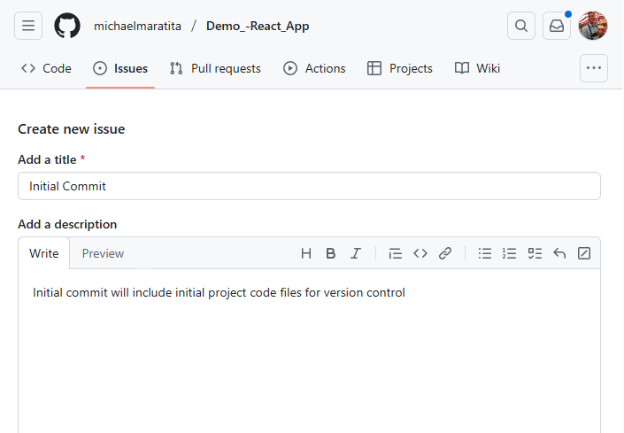
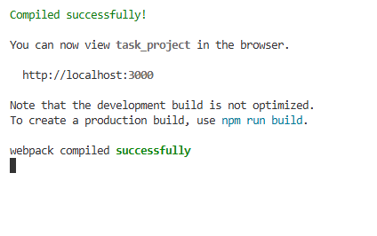

# 💻 Task App – React Frontend with AWS Amplify

This guide walks you through setting up the frontend for a task management app using React and AWS Amplify.

> 🧭 For initial setup, follow the [Amplify CLI Getting Started Guide](https://docs.amplify.aws/gen1/react/start/getting-started/installation/) to install and configure Amplify CLI and AWS credentials.

## 📁 GitHub Repository Setup

1. **Create a new repository** on GitHub:

   - Set repository name (e.g., `demo-react-app`)
   - Optionally, add a description and README
   - Click **Create repository**


2. **Clone the repo locally**

   - Copy the HTTPS URL from the GitHub **Code** tab
   - In your IDE terminal, run:

   ```
   git clone <PASTE_URL_HERE>
   cd <repo-folder>
   ```


### 🛠️ Initial GitHub Issue and Branch

1. Go to the **Issues** tab → **New Issue**
2. Fill in title and description → Click **Create**
3. Click **Create a Branch** → Confirm branch creation
4. Follow GitHub's instructions to check out the new branch:

```
git fetch origin
git checkout <new-branch-name>
```





## ⚛️ Create a New React App

```
npx create-react-app task_project
cd task_project
```

> When prompted, type `y` to proceed


### 🚀 Initialize Amplify

```
amplify init
```

- Type `y` to continue
- Choose `Prefer not to answer`
- Use AWS profile configured initally
- Type `n` to sharing non-sensitive configurations
- Press **Enter** to keep the default project name
- Type `y` to initialize the project


### 🔐 Configuring Cognito for Amplify

```
amplify add auth
```

- Select `Default Configuration`
- Select `Username` authentication
- Select `No, I am done.`


### ➡️ Push to Amplify

```
amplify push
```

- Type `y` to confirm resource deployment


### ✅ Validate Amplify

1. Visit the AWS Console

2. Search for **Amplify**

3. Confirm your app is listed


### Initial Commit to Branch

1. Copy `.gitignore` from your project folder to the root of the repo

2. Comment out line 36 to allow `aws-exports.js`

3. Add your React project folder name (e.g., `task_project`) to `.gitignore`


```
cd <repo-folder>
git add .
git commit -m "Initial commit"
git push
```


4. Create a pull request on GitHub

5. Merge the pull request

6. Delete branch

7. Switch to `main` and pull merged updates

```
git checkout main
git pull
```


## 🧱 Modify App.js

1. Create a new issue and branch

2. In the terminal, check out the new branch

3. Install Amplify libraries:

```
cd task_project
npm install aws-amplify @aws-amplify/ui-react
```

4. Replace the contents of `App.js` with the [App.js code here](#appjs-code)

5. Replace the placeholder `API_URL` on line 13 with your API Gateway URL


## 🎨 Modify App.css

1. Replace the contents of App.css with the [App.css code here](#appcss-code)

## 🧱 Create AuthHeader.js

1. Inside the `src/` folder, create `AuthHeader.js` and paste:

```js
import React from "react";

export default function AuthHeader() {
  return (
    <div style={{ textAlign: "center", marginBottom: "2rem" }}>
      
      <h2 style={{ color: "#f1f1f1", fontWeight: 600, fontSize: "24px" }}>
        Task Login Page
      </h2>
    </div>
  );
}
```

## 📷 Add Images

Add the following images to your `public/` directory:

#### checked.svg


#### unchecked.svg


## 👀 Test Locally

Run the app locally:

```
npm start
```




- Sign up for a new account

- Verify the confirmation code via email

- Add or delete tasks to test full functionality

- To **STOP** local instance:

```
ctrl + c
```

> Note: The entries from previous backend testing should be listed


### Example Task Add


## Deploying to Amplify

1. Copy `src/*`, `public/*`, and `package.json` from `task_project` into the root GitHub repo folder

2. Push changes:


```
cd ..
git add .
git commit -m "Updated app files"
git push
```

3. Create a PR and merge to `main`

4. Checkout `main` and pull updates

```
git checkout main
git pull
```

5. In the **Amplify Console**:

   - Click **Get started** under **Host a web app**

   - Connect your GitHub repo

   - Select **Only selected repositories**

   - Select **IAM Role** with **AmplifyAdministratorFullAccess** created from Backend steps

   - Complete the setup and click **Save and Deploy**


## 🎉 Deployment Complete!

You now have a fully functional and deployed React Task App using AWS Amplify.


You have successfully deployed a React App to Amplify!

## 🧹 Cleanup (Optional)

If you'd like to remove all resources created during this project, follow these steps:

#### 1. Delete the Amplify App & Authentication Resources

This will delete the Amplify app, including hosting, Amazon Cognito user pools, and other provisioned services:

```
cd task_project
amplify delete
```

> ⚠️ This action is irreversible. Make sure you're ready to delete all associated Amplify resources.

#### 2. Manually Remove Backend AWS Resources

In the AWS Console, navigate to the following services and delete the resources associated with this app:

- **DynamoDB** – Delete the table used for storing tasks

- **API Gateway** – Remove the API used to connect the frontend to Lambda

- **Lambda** – Delete the function handling task logic

✅ All project resources will now be cleaned up from both your local environment and AWS.

## 📁 Appendix

### App.js Code

```js
import React, { useState, useEffect } from "react";
import "./App.css";
import AuthHeader from "./AuthHeader";

import { Amplify } from "aws-amplify";
import { Authenticator } from "@aws-amplify/ui-react";
import { ThemeProvider, createTheme } from "@aws-amplify/ui-react";
import "@aws-amplify/ui-react/styles.css";

import awsExports from "./aws-exports";
Amplify.configure(awsExports);

const API_URL = "INPUT_API_GATEWAY HERE";

const customTheme = createTheme({
  name: "dark-theme",
  tokens: {
    colors: {
      background: {
        primary: { value: "#1a1a1d" },
      },
      font: {
        primary: { value: "#f1f1f1" },
        secondary: { value: "#ccc" },
      },
      brand: {
        primary: {
          10: "#007b83",
          80: "#00adb5",
          100: "#00adb5",
        },
      },
    },
    components: {
      button: {
        primary: {
          backgroundColor: { value: "#00adb5" },
          color: { value: "#fff" },
          _hover: {
            backgroundColor: { value: "#00c8d6" },
          },
        },
      },
    },
  },
});

function App() {
  const [tasks, setTasks] = useState([]);
  const [input, setInput] = useState("");

  useEffect(() => {
    fetchTasksFromAPI();
  }, []);

  async function fetchTasksFromAPI() {
    try {
      const response = await fetch(API_URL, {
        method: "POST",
        headers: { "Content-Type": "application/json" },
      });
      const data = await response.json();
      setTasks(data.items || []);
    } catch (error) {
      console.error("Failed to fetch tasks:", error);
    }
  }

  async function addTask() {
    if (!input.trim()) {
      alert("Input cannot be empty!");
      return;
    }

    try {
      await fetch(API_URL, {
        method: "POST",
        headers: { "Content-Type": "application/json" },
        body: JSON.stringify({
          task: input,
          complete: "false",
          action: "add",
        }),
      });
      setInput("");
      fetchTasksFromAPI();
    } catch (error) {
      console.error("Error saving task:", error);
      alert("Could not save task.");
    }
  }

  async function deleteTask(taskName) {
    try {
      await fetch(API_URL, {
        method: "POST",
        headers: { "Content-Type": "application/json" },
        body: JSON.stringify({
          task: taskName,
          complete: "true",
          action: "delete",
        }),
      });
      fetchTasksFromAPI();
    } catch (error) {
      console.error("Error deleting task:", error);
      alert("Could not delete task.");
    }
  }

  async function updateTaskCompletion(taskName, complete) {
    try {
      await fetch(API_URL, {
        method: "POST",
        headers: { "Content-Type": "application/json" },
        body: JSON.stringify({
          task: taskName,
          complete: complete.toString(),
          action: "update",
        }),
      });
      fetchTasksFromAPI();
    } catch (error) {
      console.error("Error updating task:", error);
      alert("Could not update task.");
    }
  }

  return (
    <ThemeProvider theme={customTheme}>
      <div className="auth-container">
        <Authenticator components={{ Header: AuthHeader }}>
          {({ signOut }) => (
            <div className="container">
              <div className="todo-app">
                <h2>To-Do Tasks</h2>
                <div className="row">
                  <input
                    type="text"
                    placeholder="Add your task"
                    value={input}
                    onChange={(e) => setInput(e.target.value)}
                    onKeyDown={(e) => e.key === "Enter" && addTask()}
                  />
                  <button onClick={addTask}>Add</button>
                </div>
                <ul>
                  {tasks.map((task) => (
                    <li
                      key={task.task}
                      className={
                        task.complete === "true" || task.complete === true
                          ? "checked"
                          : ""
                      }
                      onClick={() =>
                        updateTaskCompletion(
                          task.task,
                          !(task.complete === "true" || task.complete === true)
                        )
                      }
                    >
                      {task.task}
                      <span
                        onClick={(e) => {
                          e.stopPropagation();
                          deleteTask(task.task);
                        }}
                      >
                        &times;
                      </span>
                    </li>
                  ))}
                </ul>
                <button onClick={signOut} style={{ marginTop: "20px" }}>
                  Sign Out
                </button>
              </div>
            </div>
          )}
        </Authenticator>
      </div>
    </ThemeProvider>
  );
}

export default App;
```

[return to App.js](#-modify-appjs)

### App.css Code

```css
* {
  margin: 0;
  padding: 0;
  font-family: "Poppins", sans-serif;
  box-sizing: border-box;
}

.container {
  width: 100%;
  min-height: 100vh;
  background: linear-gradient(135deg, #1a1a1d, #3a3a3d);
  padding: 20px;
  color: #f1f1f1;
}

.todo-app {
  width: 100%;
  max-width: 600px;
  background: #2a2a2e;
  margin: 100px auto 20px;
  padding: 40px 30px 50px;
  border-radius: 12px;
  box-shadow: 0 4px 20px rgba(0, 0, 0, 0.4);
}

.todo-app h2 {
  color: #f1f1f1;
  display: flex;
  align-items: center;
  margin-bottom: 30px;
  font-size: 28px;
}

.todo-app h2 img {
  width: 40px;
  margin-left: 12px;
  filter: brightness(1.2);
}

/* Input row styling */
.row {
  display: flex;
  align-items: center;
  justify-content: space-between;
  background: #3d3d42;
  border: 1px solid #555;
  border-radius: 30px;
  padding: 12px 20px;
  margin-bottom: 30px;
  box-shadow: inset 0 0 5px #000;
}

input {
  flex: 1;
  border: none;
  outline: none;
  background: transparent;
  color: #f1f1f1;
  font-size: 16px;
  padding: 8px 0;
}

input::placeholder {
  color: #aaa;
}

button {
  border: none;
  outline: none;
  padding: 12px 32px;
  background: #00adb5;
  color: white;
  font-size: 16px;
  font-weight: 600;
  cursor: pointer;
  border-radius: 30px;
  transition: background 0.3s, transform 0.1s;
}

button:hover {
  background: #00c8d6;
}

button:active {
  transform: scale(0.98);
}

/* Task list */
ul {
  padding-left: 0;
}

ul li {
  list-style: none;
  font-size: 17px;
  padding: 14px 8px 14px 50px;
  user-select: none;
  cursor: pointer;
  position: relative;
  border-bottom: 1px solid #444;
  transition: background 0.2s;
  color: #ddd;
}

ul li:hover {
  background: #333;
}

ul li::before {
  content: "";
  position: absolute;
  height: 26px;
  width: 26px;
  border-radius: 50%;
  background-image: url("../public/unchecked.svg");
  background-size: cover;
  background-position: center;
  top: 14px;
  left: 10px;
}

ul li.checked {
  color: #777;
  text-decoration: line-through;
}

ul li.checked::before {
  background-image: url("../public/checked.svg");
}

ul li span {
  position: absolute;
  right: 10px;
  top: 12px;
  width: 36px;
  height: 36px;
  font-size: 20px;
  color: #aaa;
  line-height: 36px;
  text-align: center;
  border-radius: 50%;
  transition: background 0.2s, color 0.2s;
}

ul li span:hover {
  background: #444;
  color: #fff;
}

.auth-container {
  display: flex;
  align-items: center;
  justify-content: center;
  min-height: 100vh;
  background: linear-gradient(135deg, #0f0f11, #1a1a1d);
  padding: 40px;
}

.amplify-authenticator {
  max-width: 420px;
  width: 100%;
  border-radius: 12px;
  background: #2a2a2e;
  box-shadow: 0 4px 25px rgba(0, 0, 0, 0.6);
  padding: 30px 25px;
}

.amplify-button--primary {
  background-color: #00adb5;
}

.amplify-button--primary:hover {
  background-color: #00c8d6;
}

.amplify-Field__input {
  background: #3d3d42;
  border: 1px solid #555;
  color: #f1f1f1;
  border-radius: 8px;
  padding: 12px;
}

.amplify-Button--primary {
  background-color: #00adb5;
  color: white;
  border-radius: 30px;
  padding: 12px 32px;
}

.amplify-Button--primary:hover {
  background-color: #00c8d6;
}
```

[return to App.css](#-modify-appcss)
